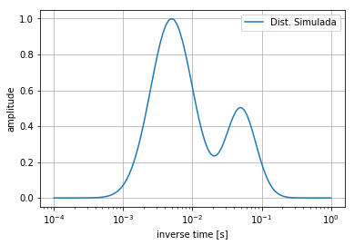
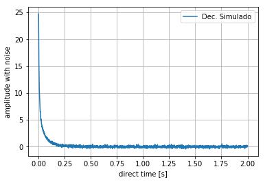
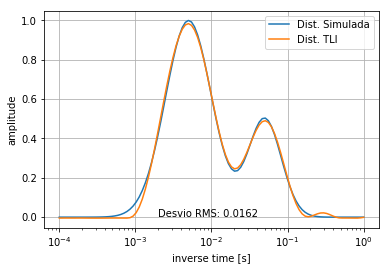

# Implementação de técnicas de transformada de Laplace inversa em relaxometria por Ressonância Magnética Nuclear (RMN) no domínio do tempo


## Sobre o Projeto

Este trabalho foi desenvolvido entre os anos 2018-2019 como parte de uma iniciação científica durante minha graduação em Licenciatura em Física na Universidade Federal de São Carlos, campus Araras.
Foram empregados algoritmos desenvolvidos em Python 2.7 para estudar, implementar e validar métodos computacionais de Transformada de Laplace Inversa (TLI) para a obtenção de distribuições de tempos de relaxação em Ressonância Magnética Nuclear no Domínio do Tempo (RMN-DT).

Apesar do viés acadêmico-científico, este projeto também marcou meu **primeiro contato prático com programação em Python**, aprendendo do zero conceitos fundamentais da linguagem e bibliotecas como:

- [NumPy](https://numpy.org/): manipulação de arrays
- [Matplotlib](https://matplotlib.org/): criação de gráficos e visualizações
- Lógica de programação, funções, controle de fluxo, manipulação de arquivos, orientação ao objeto, etc.

## :open_file_folder: Estrutura do Projeto 

```bash
📁 data/
    ├── 📄 amostraA_tratada.txt
    ├── 📄 amostraB_tratada.txt
    ├── 📄 amostraD_tratada.txt
    ├── 📄 amostraE_tratada.txt
    ├── 📄 amostraF_tratada.txt
    ├── 📄 amostraG_tratada.txt
    ├── 📄 amostraGB_tratada.txt
    ├── 📄 amostraGD_tratada.txt
    ├── 📄 amostraGF_tratada.txt
    ├── 📄 amostraGH_tratada.txt
    ├── 📄 amostraH_tratada.txt
    ├── 📄 amostraporA_tratada.txt
    ├── 📄 amostraporAB_tratada.txt
    ├── 📄 amostraporAC_tratada.txt
    ├── 📄 amostraporB_tratada.txt
    ├── 📄 amostraporBC_tratada.txt
    └── 📄 amostraporC_tratada.txt
📁 laplin/
    └── 📄 Laplin.py
📁 notebooks/
    ├── 📁 samples/
    │   ├── 📄 laplin_res_amostra-A.ipynb
    │   ├── 📄 laplin_res_amostra-B.ipynb
    │   ├── 📄 laplin_res_amostra-D.ipynb
    │   ├── 📄 laplin_res_amostra-E.ipynb
    │   ├── 📄 laplin_res_amostra-F.ipynb
    │   ├── 📄 laplin_res_amostra-G.ipynb
    │   ├── 📄 laplin_res_amostra-GB.ipynb
    │   ├── 📄 laplin_res_amostra-GD.ipynb
    │   ├── 📄 laplin_res_amostra-GF.ipynb
    │   ├── 📄 laplin_res_amostra-GH.ipynb
    │   ├── 📄 laplin_res_amostra-H.ipynb
    │   ├── 📄 laplin_res_amostra-porA.ipynb
    │   ├── 📄 laplin_res_amostra-porAB.ipynb
    │   ├── 📄 laplin_res_amostra-porAC.ipynb
    │   ├── 📄 laplin_res_amostra-porB.ipynb
    │   ├── 📄 laplin_res_amostra-porBC.ipynb
    │   └── 📄 laplin_res_amostra-porC.ipynb
    ├── 📁 simulations/
    │   ├── 📄 laplin_sim_bimodal_ma-me_10pt.ipynb
    │   ├── 📄 laplin_sim_bimodal_ma-me_50pt.ipynb
    │   ├── 📄 laplin_sim_bimodal_ma-me_100pt.ipynb
    │   ├── 📄 laplin_sim_bimodal_me-ma_10pt.ipynb
    │   ├── 📄 laplin_sim_bimodal_me-ma_50pt.ipynb
    │   ├── 📄 laplin_sim_bimodal_me-ma_100pt.ipynb
    │   ├── 📄 laplin_sim_bimodal_pi_10pt.ipynb
    │   ├── 📄 laplin_sim_bimodal_pi_50pt.ipynb
    └── └── 📄 laplin_sim_bimodal_pu_100pt.ipynb
📁 outputs/
    ├── 📁 decay/
    │   ├── 📄 Decay_B.png
    │   ├── 📄 Decay_D.png
    │   ├── 📄 Decay_F.png
    │   ├── 📄 Decay_G.png
    │   ├── 📄 Decay_GB.png
    │   ├── 📄 Decay_GD.png
    │   ├── 📄 Decay_GF.png
    │   ├── 📄 Decay_GH.png
    │   ├── 📄 Decay_H.png
    │   ├── 📄 Decay_porA.png
    │   ├── 📄 Decay_porAB.png
    │   ├── 📄 Decay_porAC.png
    │   ├── 📄 Decay_porB.png
    │   ├── 📄 Decay_porBC.png
    │   └── 📄 Decay_porC.png    
    ├── 📁 inverse/
    │   ├── 📄 B_inverse.png
    │   ├── 📄 D_inverse.png
    │   ├── 📄 F_inverse.png
    │   ├── 📄 G_inverse.png
    │   ├── 📄 GB_inverse.png
    │   ├── 📄 GD_inverse.png
    │   ├── 📄 GF_inverse.png
    │   ├── 📄 GH_inverse.png
    │   ├── 📄 H_inverse.png
    │   ├── 📄 porA_inverse.png
    │   ├── 📄 porAB_inverse.png
    │   ├── 📄 porAC_inverse.png
    │   ├── 📄 porB_inverse.png
    │   ├── 📄 porBC_inverse.png
    │   └── 📄 porC_inverse.png
    ├── 📄 example_decay_sim.png
    ├── 📄 example_dist_sim.png
    └── 📄 example_res_sim.png
📁 report/
    └── 📄 relatorio_final.pdf
📄 README.md
```

> [!IMPORTANT]
> A biblioteca Laplin, de autoria do meu orientador, Prof. João Teles Carvalho Neto, encontrava-se previamente desenvolvida no início do projeto, de modo que não contribuí para sua construção, apenas seu uso e validação em amostras simuladas e reais.

## Compatibilidade

> [!WARNING]
> Os notebooks foram originalmente desenvolvidos em **Python 2.7**, versão atualmente obsoleta e não suportada oficialmente pelo Jupyter ou Docker Hub.

Por questões de compatibilidade, este repositório é disponibilizado apenas para **consulta e visualização**. Para facilitar acesso ao conteúdo:

- Os notebooks estão disponíveis em formado .ipynb
- Imagens e gráficos foram preservados em alta resolução
- O código-fonte foi mantido inalterado para fins históricos e de documentação.

## Aprendizados Pessoais

Este projeto me proporcionou:

- Conceitos fundamentais da linguagem de programação Python
- Compreensão de conceitos numéricos e discretos aplicados a problemas reais
- Habilidade de estruturar, testar e visualizar dados com código

Também me ensinou sobre:

- A importância da clareza no código
- A documentação de trabalhos científicos com reprodutibilidade
- O uso de notebooks como ferramenta de comunicação técnica

## Exemplos

1. Importando as bibliotecas necessárias e criando uma distribuição de tempos de relaxação:

```python
import Laplin as lp
import numpy as np
import matplotlib.pyplot as plt

np.random.seed(1) #inicia um gerador de números pseudo-aleatórios para adição de ruído ao decaimento

mg = [[5e-3,0.7,1],[5e-2,0.5,0.5]] #[tc, dt, amp]
sim = lp.MultiGauss(mg)
sim.genData(1e-4,1e0,100) #[Xi, Xf, N]

plt.plot(sim.X,sim.Y)
plt.xlabel('inverse time [s]')
plt.ylabel('amplitude')
plt.xscale('log')
plt.grid(True)
plt.legend(['Dist. Simulada'],loc=0)
plt.savefig('Sim_Dist_Mm_100pt.png',dpi=300)
```



2. A partir dos dados da distribuição de tempos de relaxação, criada anteriormente, define-se parâmetros para a recuperação da curva de decaimento, adicionando ruído:

```python
# Signal-to-Noise Ratio - SNR = 100

sig4 = lp.NMRDecay(sim, 'cpmg') #'cpmg'/'invrec'
sig4.genX(1e-4,2,2000) #xi, xf, N
sig4.genY()
sig4.addGaussNoise(1e2)

plt.plot(sig4.x,sig4.yn)
plt.xlabel('direct time [s]')
plt.ylabel('amplitude with noise')
plt.grid(True)
plt.legend(['Dec. Simulado'],loc=0)
plt.savefig('Sim_Decay_1e2_Mm_100pt.png',dpi=300)
```



3. Em seguida, aplica-se a função `FindOpt` para buscar, em escala logarítmica, os parâmetros de penalização (N, G e C) que resultam no melhor ajuste, ou seja, menor desvio RMS:

```python
def FindOpt(ni,nf,Ns,gi,gf,Gs,ci,cf,Cs,reg):
    #Ajuste Grosso
    Bn = (nf/ni)**(1.0/(Ns-1))
    Bg = (gf/gi)**(1.0/(Gs-1))
    Bc = (cf/ci)**(1.0/(Cs-1))
    Min = 1e10
    for i in range(Ns):
        n=ni*Bn**i
        print "Laço ",n," da varredura em Ns."
        for j in range(Gs):
            g=gi*Bg**j
            for k in range(Cs):
                c=ci*Bc**k
                reg.genY([n,g,c],0,'nn0')
                RMS = lp.rmsDiff(sim.Y,reg.Y)
                if RMS < Min:
                    Min = RMS
                    PRes = [RMS,n,g,c]
                    print 'Última otimização do ajuste grosso: ',PRes
    #Ajuste Fino
    Bn = Bn**(1.0/(Ns-1))
    Bg = Bg**(1.0/(Gs-1))
    Bc = Bc**(1.0/(Cs-1))
    for i in range(Ns):
        n=PRes[1]*Bn**i
        print "Laço ",n," da varredura em N."
        for j in range(Gs):
            g=PRes[2]*Bg**j
            for k in range(Cs):
                c=PRes[3]*Bc**k
                reg.genY([n,g,c],0,'nn0')
                RMS = lp.rmsDiff(sim.Y,reg.Y)
                if RMS < Min:
                    Min = RMS
                    PRes = [RMS,n,g,c]
                    print 'Última otimização do ajuste fino: ',PRes
    return PRes

reg4 = lp.InvLaplace(sig4, 0) #0=cpmg/1=invrec
reg4.genX(1e-4,1e0,100) #Xi, Xf, N

Opt4 = FindOpt(1e-8,2,10,1e-8,4,10,1e-8,77,10,reg4)
print Opt4
```
Neste exemplo, retornou:

```python
Opt4 = [0.016199174274152295, 0.03621083296484821, 0.5655536626848444, 8.1291885496028]

# Opt4[0] -> Desvio RMS
# Opt4[1] -> penalização da norma (n)
# Opt4[2] -> penalização do gradiente (g)
# Opt4[3] -> penalização da curvatura (c)
```

4. Por fim, aplica-se os parâmetros encontrados para recuperarmos a curva inicialmente simulada:

```python
reg4 = lp.InvLaplace(sig4, 0) #0=cpmg/1=invrec
reg4.genX(1e-4,1e0,100) #Xi, Xf, N
reg4.genY([Opt4[1], Opt4[2], Opt4[3]], 0, 'nn0') #[N,G,C], 0=noTSVD/1=TSVD, '0'/'nn0'/'nnx'/'x'

plt.plot(sim.X,sim.Y)
plt.plot(reg4.X,reg4.Y)
plt.xlabel('inverse time [s]')
plt.ylabel('amplitude')
plt.xscale('log')
plt.grid(True)
plt.legend(['Dist. Simulada','Dist. TLI'],loc=0)
plt.text(0.002,0,'Desvio RMS: 0.0162')
plt.savefig('Sim_Comp_1e2_Mm_100pt.png',dpi=300)
```




## Referências Bibliográficas

1 KELLOGG, J. M. B.; RABI, I. I.; ZACHARIAS, J. R. The gyromagnetic properties of the hydrogens. Physical Review, v. 50, n. 5, p. 472, 1936.  
2 RABI, I. I. Space quantization in a gyrating magnetic field. Physical Review, v. 51, n. 8, p. 652, 1937.  
3 RABI, I. I. et al. A new method of measuring nuclear magnetic moment. Physical Review, v. 53, n. 4, p. 318, 1938.  
4 BLOCH, F. Nuclear induction. Physical Review, v. 70, n. 7-8, p. 460, 1946.  
5 BLOCH, F.; HANSEN, W. W.; PACKARD, M. The nuclear induction experiment.
Physical Review, v. 70, n. 7-8, p. 474, 1946.  
6 PURCELL, E. M.; TORREY, H. C.; POUND, R. V. Ressonance absorption by nuclear magnetic moments in a solid. Physical Review, v. 69, n. 1-2, p. 37, 1946.  
7 HAHN, E. L. Spin echoes. Physical Review, v. 80, n. 4, p. 580, 1950.  
8 CARR, H. Y.; PURCELL, E. M. Effects of diffusion on free precession in nuclear magnetic ressonance experiments. Physical Review, v. 94, n. 3, p. 630, 1954.  
9 MEIBOOM, S.; GILL, D. Modified spin-echo method for measuring nuclear relaxation times. Review of Scientific Instruments, v. 29, n. 8, p. 688, 1958.  
10 SUN, Q. et al. Electronic active defects and local order in doped zno ceramics inferred from epr and 27ai nmr investigations. Journal of European Ceramic Society, v. 39, n. 10, p. 3070, 2019.  
11 SANTOS, P. M.; COLNAGO, L. A. Comparison among mir, nir and lf-nmr
techniques for quality control of jam using chemometrics. Food Analytical Methods, v. 11, n. 7, p. 2029, 2018.  
12 HOHMANN, M. et al. 1h nmr profiling as an approach to differentiate conventionally and organic grown tomatoes. Journal of Agricultural and Food Quemistry, v. 62, n. 33, p. 8530, 2014.  
13 MITCHELL, J.; HOWE, A. M.; CLARKE, A. Real-time oil-saturation monitoring in rock cores with low-field nmr. Journal of Magnetic Ressonance, v. 256, p. 34, 2015.  
14 ANDRADE, L. et al. Characterization of encapsulated flavor systems by nir and low-field td-nmr: A chemometric approach. Food Biophysics, v. 3, n. 1, p. 33, 2008.  
15 RONDEAU-MOURO, C. et al. Characterization of solid content and distinction between type a and b crystals of tbab hydrates by time domain nmr. Chemical Engineering Science, v. 138, n. 69, p. 544, 2015. 
16 MCWHIRTER, J. G.; PIKE, E. R. On the numerical inversion of the laplace
transform and similar fredholm integral equations of the first kind. Journal Of Physics A: Mathematical and General, v. 11, n. 9, p. 1729, 1978.  
17 BORGIA, G. C.; BROWN, R. J. S.; FANTAZZANI, P. Uniform-penalty inversion of multiexponential decay data. Journal Of Magnetic Ressonance, v. 132, n. 1, p. 65, 1998.  
18 CELIK, H. et al. Stabilization of the inverse laplace transform of multiexponential decay through introduction of a second dimension. Journal Of Magnetic Ressonance, v. 236, p. 134, 2013. 
19 GAO, Y. et al. The generalized phillips-twomey method for nmr relaxation time. Journal Of Magnetic Ressonance, v. 271, p. 1, 2016.  
20 D’EURYDICE, M. N. Desenvolvimento de metodologias para estudo de meios
porosos por ressonância magnética nuclear. Tese (Doutorado) — Universidade de São Paulo, 2011.  
21 ZOU, Y. et al. Inversion of nuclear magnetic resonance echo data based on
maximum entropy. GEOPHYSICS, Society of Exploration Geophysicists, v. 81, p.
D1–D8, 2016.  
22 PAIVA, F. F. Metodologia de imagens de NMR que utiliza um único pulso adiabático de inversão. 116 p. Dissertação (Mestrado) — Instituto de Física de São Carlos - Universidade de São Paulo, 2011.  
23 COATES, G. R.; XIAO, L.; PRAMMER, M. G. NMR Logging Principles and
Applications. [S.l.]: Halliburton Energy Services, 2001. 233 p. 27.

## Autores

João José Ambrozetto  
Projeto realizado como parte do Programa Institucional de Bolsas de Iniciação Científica (PIBIC), edital 001/2018.  
Universidade Federal de São Carlos (UFSCar) - *campus* Araras

João Teles de Carvalho Neto  
[ResearcheGate](https://www.researchgate.net/profile/Joao-Teles-De-Carvalho-Neto)  
Professor do Departamento de Ciências da Natureza, Matemática e Educação (DCNME)
Universidade Federal de São Carlos (UFSCar) - *campus* Araras

## Nota Final

Este projeto representa um ponto de partida importante da minha trajetória como programador. Ele está sendo mantido como parte do meu portifólio por seu valor formativo e histórico, mesmo não sendo compatível com os ambientes modernos.
